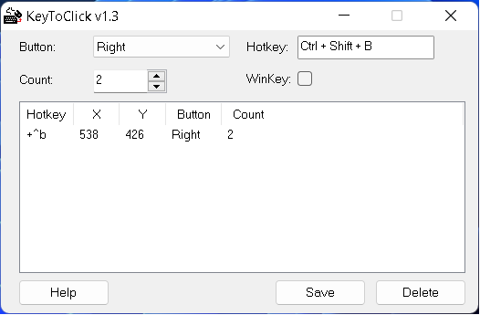

# keyToClick

This is a tool that converts keystrokes into click actions (like a feature in bluestacks). 

I wrote it in my 2nd year to help with my part-time job.

Main UI:

You can download ahk from https://www.autohotkey.com/ to run my script or run the .exe built version 

# KeyToClick v1.3       
Programed by Phạm Đức Vượng in AHK

*******************************************************************

                                                               INTRUCTIONS
1. Select Mouse Button, Count and Hotkey 
    (Tick the WinKey box to use Winkey)
2. Move the mouse pointer to the position need to click
3. Press F2 to add your options to the list (Max 50)
4. And now your keys are ready to click
5. Save your list for use in your next time
    (Data will be saved to KeyToClick.ini)
